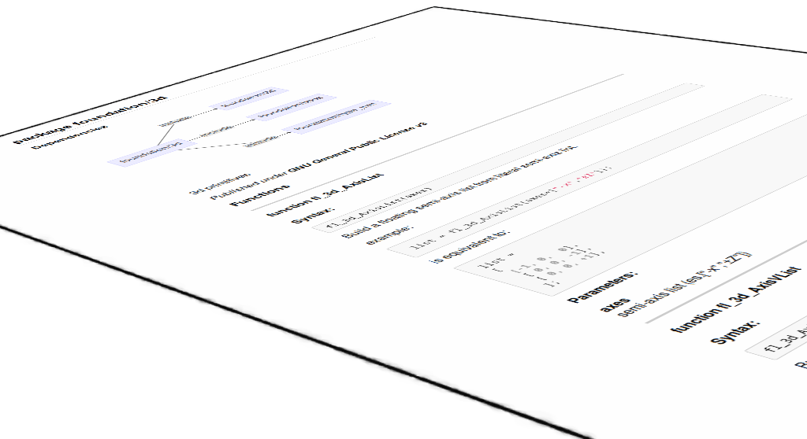

# OrthoDocs

OrthoDocs is an API documentation generator and static analysis tool for the OpenSCAD scripting language. For the list of the feature planned and their status see [Project status](#project-status).

## Design

OrthoDocs comes with a complete OpenSCAD language parser, able to recognize all the public global functions, modules and variables found in the source tree, complete with parameters and their default values. Sources can be passed as files, directories or both. Each source file (here referred to as *package*) will produce a corresponding API document.
Even in a completely uncommented source tree, OrthoDocs will create a document with the following items:

* package name;
* package dependency tree (in textual or graphical mode);
* global variables (name and eventual default value);
* global functions signatures (function name, parameters and eventual defaults);
* global modules signature (name, parameters and eventual defaults);
* one optional Table of Contents for all the items documented in the whole source tree;
* any number of dependecy graphs reassuming the system parts correlation in whatever part of the source tree.

[Here](docs/examples/documents/uncommented.md) you can find the produced document from an uncommented [source file](docs/examples/sources/uncommented.scad):

### Annotations

Orthodocs annotations are single line or C-style block comments in which the comment start is immediately followed by the `!` character. All the other comments are ignored.

    /*
     * This is a C-style block comment and is ignored by OrthoDocs
     */

    // This is a single line comment ignored as well

    /*!
     * This is a C-style block comment interpreted
     * as a multi
     * line annotation
     */

     //! This is a single line comment interpreted as a single line annotation

[Here](docs/examples/documents/annotated.md) a document example from the same [source file](docs/examples/sources/annotated.scad) enriched with annotations.

## The command line

OrthoDocs is a CLI only utility, the basic invocation is:

    $ orthodocs --src-root «path to source-root directory» --doc-root «path to document-root» «list of files and/or directory relative to source-root»

OrthoDocs will search in all the input directories for any scad file, the resulting file list being merged with the files eventually passed as positionals and analized.
The analysis results will be used for producing a number of Markdown documents (one for each
source file analized).

Assuming the following directory tree:

    /home/
    └── giampa/
        └── example/
            └── sources/
                ├── 2d.scad
                ├── annotated.scad
                ├── bbox.scad
                ├── type_trait.scad
                └── uncommented.scad

the following command executed in the directory «/home/giampa»

    /home/giampa $ orthodocs --src-root example/sources --doc-root example/docs

will scan all the SCAD sources in the source-root and produce the consequent documents in the doc-root

    /home/
    └── giampa/
        └── example/
            ├── docs/
            │   ├── 2d.md
            │   ├── annotated.md
            │   ├── bbox.md
            │   ├── type_trait.md
            │   └── uncommented.md
            └── sources/
                ├── 2d.scad
                ├── annotated.scad
                ├── bbox.scad
                ├── type_trait.scad
                └── uncommented.scad

If we want to keep the same source-root while documenting only one subset of the present sources the following command

    /home/giampa $ orthodocs --src-root example/sources --doc-root example/docs annotated.scad uncommented.scad

will produce

    /home/
    └── giampa/
        └── example/
            ├── docs/
            │   ├── annotated.md
            │   └── uncommented.md
            └── sources/
                ├── 2d.scad
                ├── annotated.scad
                ├── bbox.scad
                ├── type_trait.scad
                └── uncommented.scad

### Full command options

For more complex tasks consult the full command option list:

| Option             | Description
| ------------------ | -----------
| -a,--admonitions   | **FLAG** - When this flag is enabled any admonition found in annotations will be enriched with a corresponding emoj
| -d,--doc-root      | **OPTION** - Specifies the target document tree root either as absolute or current directory relative path. It is a **mandatory directory** parameter and - if not existing - it will be automatically created.
| -g,--graphs        | **OPTION** - List of root relative directories where placing dependency graphs. Needs --src-root.
| -h,--help          | **FLAG** - Print the help message and exit
| -i,--ignore-prefix | **OPTION** - Ignore this prefix in the Table of Contents when sorting
| --pd,--pkg-deps    | **OPTION** - Set package dependecies representation by text list or by a dependency graph (possible value **text**/**graph**, default to **text**)
| -p,--private       | **OPTION** - Every documentation item (variable, function or module) prefixed with this string will not be published.
| -q,--quiet         | **FLAG** - Quiet mode, no statistics will be printed after successfully execution.
| -s,--src-root      | **OPTION** - Source tree root - either an absolute or current directory relative path. It is a **mandatory existing directory** parameter.
| -t,--toc           | **FLAG** - Generate a Table of Contents in the document tree root
| sources            | **POSITIONAL** - source sub-trees and/or files - either as absolute or «source tree root» relative path
| -V,--verbosity     | **FLAG** - Set the message log verbosity
| -v,--version       | **FLAG** - Display program version information and exit

## Project status

The list of features expected in the v1 release with their current status:

| Feature                   | Status
| ------------------------- | ------
| [admonitions](https://www.markdownguide.org/hacks/#admonitions)| ✔
| comment styles            | ✔
| cross-reference           | ✔
| dependency graphs         | ✔
| global values             | ✔
| Linux support             | ✔
| macOS support             | ✔
| source license detection  | ✔
| table of contents         | ✔
| Windows support           | ✔

## Supported OSs

| OS                        | Status
| ------------------------- | ------
| Linux support             | ✔
| macOS support             | ✔
| Windows support           | ✔
